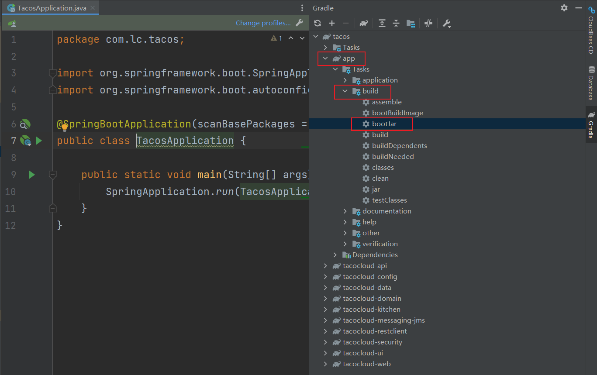
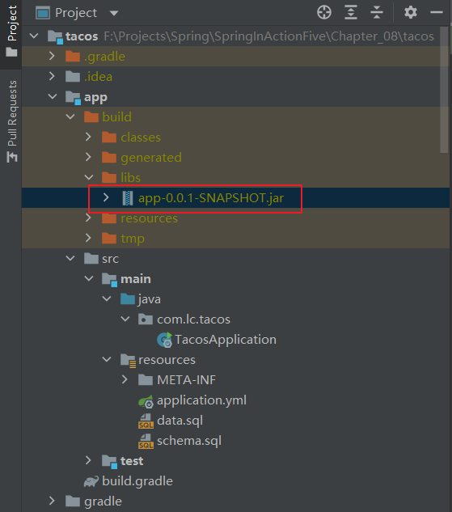
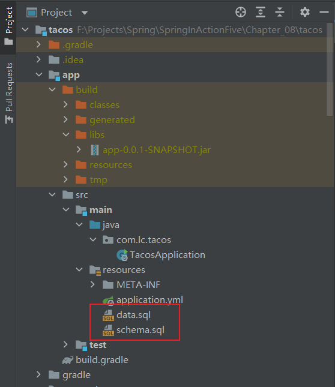

# 煎饼订购网站后端（tacos）

## 简介
**煎饼订购网站后端**是一套基于SpringBoot开源的处理煎饼相关业务信息的系统，具备用户注册、登录、订购煎饼、查看最近订购等功能。**煎饼订购网站后端**中的图片由[**<<Spring实战第5版>>**](https://www.manning.com/books/spring-in-action-fifth-edition)一书提供，代码遵循Apache v2 License开源协议，项目多模块搭建、打包、运行等参考[CSDN大佬分享链接](https://blog.csdn.net/qq_27525611/article/details/114291267)，建议事先阅读。**本软件主要作为学习和交流使用。**

## 开发环境
### 1、Java版本：1.8.0_131
### 2、MySQL版本：5.5.62

## 项目部署
### 1、环境：CentOS 7.7 64位
### 2、打包：直接运行bootJar即可：

### 运行后会在build/libs下生成JAR包：

### 3、创建MySQL数据库表，分别运行schema.sql和data.sql文件：

### 4、运行：将jar包上传至服务器后，新建tacos-server.log文件用于存放启动日志，方便后续查看排错。然后在该路径下运行`nohup java -jar app-0.0.1-SNAPSHOT.jar > tacos-server.log 2>&1 &`命令，让jar包在后台启动。

## 许可

> Copyright (C) liuhaiyang, Ganzhou Quxiang Inc. Open source codes for study only. Do not use for commercial purpose.
>
> Licensed under the Apache License, Version 2.0 (the "License"); you may not use this file except in compliance with the License. You may obtain a copy of the License at
>
> [http://www.apache.org/licenses/LICENSE-2.0](https://gitee.com/link?target=http%3A%2F%2Fwww.apache.org%2Flicenses%2FLICENSE-2.0)
>
> Unless required by applicable law or agreed to in writing, software distributed under the License is distributed on an "AS IS" BASIS, WITHOUT WARRANTIES OR CONDITIONS OF ANY KIND, either express or implied. See the License for the specific language governing permissions and limitations under the License.